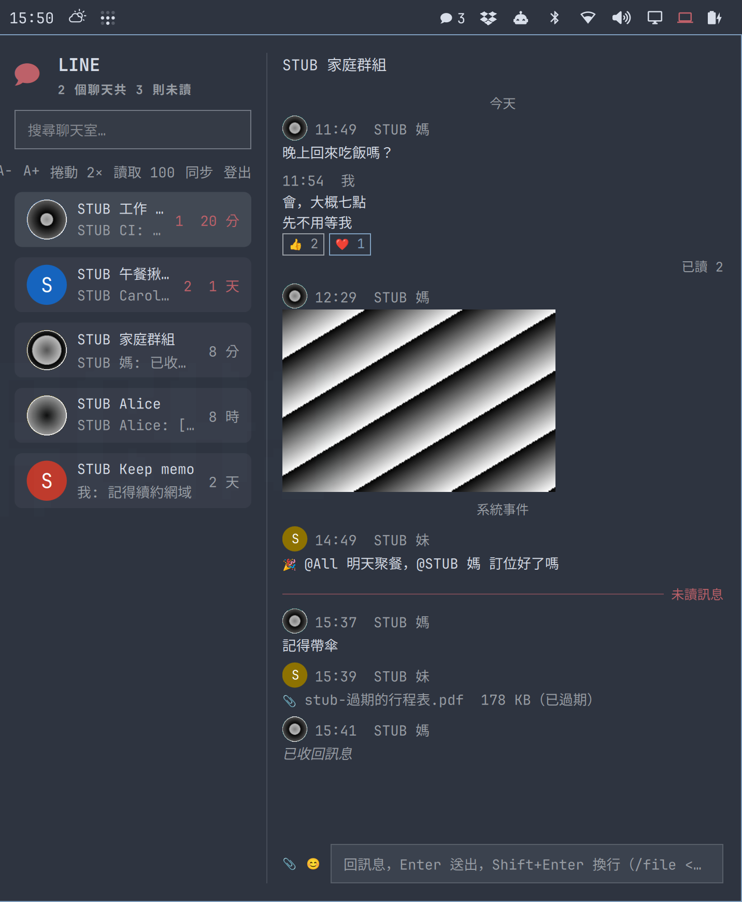
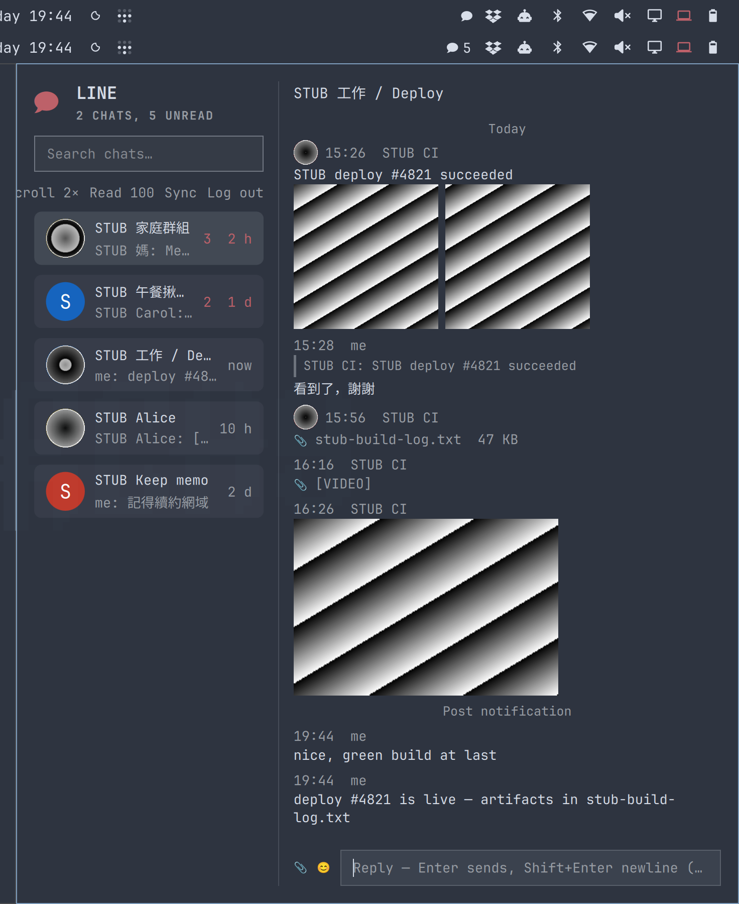

# LINE for Omarchy

[](https://github.com/frankekn/omarchy-line/actions/workflows/ci.yml)

[繁體中文](README.zh-TW.md)

Unread LINE count in the bar. Click it to search chats, read messages, reply,
and send files.

|  |  |
| :-: | :-: |
| 中文介面與對話 — mention、表情、已讀、收回、過期檔案 | English interface — FLEX card, quote replies, file & video attachments |

*The panel speaks Traditional Chinese or English (see Language under
Settings); message content in any language renders fine either way.*

This repo has two halves:

- **The plugin** (`Panel.qml`, `LinePanel.qml`, `LineWindow.qml`, `manifest.json`,
  plus the three `.pragma library` files `EventLog.js` / `PanelKit.js` /
  `DraftStore.js`) — a QML widget for the omarchy bar. It never touches LINE;
  it only reads one local JSON file and talks to one local unix socket.
  Event/message merging lives in `EventLog.js`, pure UI helpers in
  `PanelKit.js`, draft persistence in `DraftStore.js`; `Panel.qml` itself is
  just the state machine, the socket/FileView wiring, and the view.
- **The daemon** (`daemon/daemon.ts`) — the half that actually logs into LINE.
  LINE's refresh token rotates on every login, so exactly one process may hold
  it at a time.

When the daemon is down, the panel shows `DAEMON OFFLINE` (the rule:
`state.json`'s `updatedAt` hasn't moved in 3 minutes).

> This is an unofficial client (built on `@evex/linejs`). LINE does not offer a
> personal-account API; using this carries a risk of account restriction.
> Decide for yourself.

## Install

The plugin:

```bash
omarchy plugin add https://github.com/frankekn/omarchy-line.git --enable
```

The repo lands at `~/.config/omarchy/plugins/io.github.frankekn.line/`, with
the daemon under `daemon/`.

**Then you must run these two lines.** The LINE protocol half is this repo's
own linejs fork, vendored at `daemon/vendor/linejs` as a git submodule (see
[Changes in this repo](#changes-in-this-repo) for why), and
`omarchy plugin add` is a plain `git clone` — no submodules:

```bash
git -C ~/.config/omarchy/plugins/io.github.frankekn.line submodule sync -- daemon/vendor/linejs
git -C ~/.config/omarchy/plugins/io.github.frankekn.line submodule update --init
```

The first line syncs the submodule's remote config; the second fetches the
pinned revision (the public fork `frankekn/linejs`). Skip it and the daemon
dies on startup with `Module not found ".../vendor/linejs/..."`.
`omarchy plugin update` is likewise a fast-forward of the main repo only —
rerun these two lines after every update.

Stickers, the sticker picker, and FLEX images (including the lightbox) are
downloaded by the daemon into
`$XDG_STATE_HOME/enil/media/public-images` (default
`~/.local/state/enil/media/public-images`); QML only ever reads local files, so
those image requests never enter quickshell's Qt TLS. Downloads of the same URL
merge, at most 4 in flight, each capped at 10 MiB with a 20 s timeout, and the
cache shares the media sweep policy. Failed downloads never fall back to QML
HTTPS. When updating, update the panel and the daemon together, then restart
the daemon and reload the plugin.

The daemon needs [Deno](https://deno.com) 2 (`sudo pacman -S deno`).
Dependencies live in `daemon/deno.json`'s import map and fetch themselves on
first run:

| Package | Purpose |
|---|---|
| `daemon/vendor/linejs` (submodule) | LINE protocol, login, E2EE — this repo's linejs fork |
| `jsr:@std/streams` | line-based socket reads |
| `npm:qrcode` | renders the login QR as PNG |
| `npm:thrift`, `npm:crypto-js`, `npm:tweetnacl`, … | the fork's own deps, versions pinned to its `deno.json` |

The fork's bare imports are resolved by the **entry point's** config, so those
deps belong in `daemon/deno.json`, not the fork's. `nodeModulesDir` is
`"none"`: the npm packages resolve straight from Deno's global cache and no
`daemon/node_modules/` appears inside the plugin folder. The fork's own config
says `"auto"`, but that is for its workspace — the whole client (thrift,
crypto-js, the other CommonJS bits) imports fine under `"none"`.

Run it in the foreground once to prove it works:

```bash
cd ~/.config/omarchy/plugins/io.github.frankekn.line/daemon
deno run -A daemon.ts
```

Then hand it to a systemd user unit:

```bash
cp ~/.config/omarchy/plugins/io.github.frankekn.line/daemon/enil.service ~/.config/systemd/user/
systemctl --user daemon-reload
systemctl --user enable --now enil
```

The unit's `WorkingDirectory` points at the `daemon/` **inside the installed
plugin**, so

`ExecStart` runs `enil-run.sh`: it uses the `enil` binary produced by
`deno task build` only when `enil.rev`'s commit matches this checkout and
`daemon.ts` is not newer than the binary; otherwise it falls back to
`deno run -A daemon.ts`. An `omarchy plugin update` can therefore never strand
a stale binary — it just drops back to interpreted mode until you build again.

Compiling is **optional** (Deno still has to be installed to build):

```bash
cd ~/.config/omarchy/plugins/io.github.frankekn.line/daemon
deno task build    # produces ./enil (~114 MB) + ./enil.rev
```

It shaves ~20 ms off restarts and runs without a Deno runtime; not building is
completely fine and behaves identically.
`omarchy plugin update` updates the plugin and the daemon together — no need
to copy anything again. Logs:

```bash
journalctl --user -u enil -f
```

### Fresh-install checklist

On a clean machine, walk this list in order and never skip a failed step:

1. The Omarchy bar is running and you are inside a graphical session — a
   systemd **user** unit needs that to start.
2. `deno --version` prints something (Deno 2). If not, `sudo pacman -S deno`.
3. `command -v zenity` prints something. If not, `sudo pacman -S zenity` — it is
   the file picker used for sending files, and Omarchy does not preinstall it.
   Optional extras: `ffmpegthumbnailer` or `ffmpeg` gives sent videos a preview
   image, and `wl-clipboard` lets you send an image straight from the
   clipboard. Missing either just loses that one feature; nothing is blocked.
4. `omarchy plugin add https://github.com/frankekn/omarchy-line.git --enable`.
5. `git -C ~/.config/omarchy/plugins/io.github.frankekn.line submodule sync -- daemon/vendor/linejs`,
   then `git -C ~/.config/omarchy/plugins/io.github.frankekn.line submodule update --init`
   — this step needs GitHub reachable. Afterwards `daemon/vendor/linejs/packages/`
   must contain files; an empty tree means the fetch failed — do not continue.
6. `omarchy plugin validate ~/.config/omarchy/plugins/io.github.frankekn.line`
   exits 0.
7. The first `deno run -A daemon.ts` needs network access — that is when the
   JSR/npm dependencies are fetched.
8. Once it runs in the foreground, confirm `~/.local/state/enil/` exists and
   `state.json`'s `updatedAt` is moving.
9. Permissions: state dir 700, `storage.json` 600. Fix with
   `chmod 700 ~/.local/state/enil` and
   `chmod 600 ~/.local/state/enil/storage.json` if wrong.
10. Have your phone in hand, then press the panel's "登入 LINE" — the QR has a
    TTL and an unscanned attempt only leaves a dead credential behind.
11. Type the PIN the panel shows; `login.status` becomes `ok` and the `!` on
    the bar icon disappears.
12. Ctrl-C the foreground process and switch to the systemd unit (the three
    lines above); `journalctl --user -u enil` shows no red lines.

### Uninstall

```bash
systemctl --user disable --now enil
rm ~/.config/systemd/user/enil.service && systemctl --user daemon-reload
rm -rf ~/.local/state/enil          # credentials, caches and state live here
omarchy plugin remove io.github.frankekn.line
```

Deleting the state directory logs you out on this machine — the next login
needs a fresh QR scan. Remove the entry in your phone's "logged-in devices"
list separately.

## Sleep and disconnects

While a laptop sleeps, LINE's push connection half-opens: the kernel still
sees ESTABLISHED, but the daemon stops receiving anything. So the daemon both
listens for logind's `PrepareForSleep` (reconnects 3 s after wake) and checks
once a minute whether the push has been quiet for over three minutes —
rebuilding it on its own, retrying with a backoff that starts at 1 s and caps
at 60 s. A full chat-list refetch also runs every five minutes as a floor.
Errors the push connection throws with nobody listening are journaled as
`[unhandled]`: anything judged a network problem takes the reconnect path
above and does not restart the daemon; anything else is journaled the same way
but still lets the daemon exit for systemd to restart — that is the daemon's
own bug, and running on would only serve stale state.

**The linejs pusher loop dying outright is a different path**: when it cannot
connect it errors both shared streams at once, the `for await` inside
`listen()` ends, and no event arrives again until someone calls `listen()`
once more (upstream v3.4.1 states that is the caller's job). The daemon spots
this on the `log` channel via `LegyPusherError` and decides by `poll.islisten`:
linejs clears it in `finally`, so only the pass where the loop truly ended
reads false. A single message failing to decrypt, or an `InitAndRead` failure
linejs itself sleeps 4 s and retries, reports the identical type while the
loop is alive — reconnecting then would just fight over `conns[0]`, so those
two are journaled and the connection left alone. A real death zeroes the push
clock and hands back to the same watchdog above (no second backoff): one
failure writes two `LegyPusherError` lines (one from the pusher, one from the
`for await` after the streams errored) that share one backoff gate, so only
one reconnect happens. Before this, the only detector was the three-minute
quiet check.

Every request to LINE also has a header wait cap: 30 s normally, 180 s for the
obs upload host (uploads answer headers only after the whole body is sent).
The cap bounds headers, not bodies, so the push connection and media downloads
with hours-long bodies are never cut. This layer is ours: linejs sets its own
30 s timeout, but the encrypted transport rebuilt the request and dropped that
signal — effectively no timeout at all. After a laptop woke, the keep-alive
connection was long dead while the kernel disagreed, and one chat-list request
sat there for ten minutes blocking every refresh behind it. Now the worst case
is a 30 s failure plus an automatic refetch 15 s later, without waiting for
the five-minute floor poll. Tune with `ENIL_REQUEST_TIMEOUT_MS` (milliseconds).
The timeout itself (`TimeoutError`/`AbortError`) counts as a network problem
and takes the same path as a severed connection: previously it was classified
as an unknown error, where a single timed-out request nobody answered was
enough to kill the daemon for a systemd restart.

Both layers above are automatic but both make you wait: the watchdog checks
once a minute, the floor poll every five. To skip the wait, press the **同步**
button right of the list search box (keyboard `r`, or click the "LINE 連線中斷，
重連中" line under the title) — it rebuilds the push connection and refetches
the chat list immediately, re-reading the open conversation too. The button
reads "同步中…" while working, usually settling on "已同步 HH:MM" within
seconds (if a refetch was already in flight it waits out that round and the
button stays on "同步中…" meanwhile); a failure prints its reason
(`同步失敗：連不上 LINE，稍後重試` and friends), never silence. The rebuild
itself takes eight seconds (linejs's own pusher must get its recovery window
first, or both loops fight over one connection) but the sync does not wait for
it — the refetch needs no new connection, so the view comes back first and
the link heals behind it.

Reconnect records live here:

```bash
journalctl --user -u enil | grep '\[push\]'
```

A manual sync appears in the journal as `[sync] requested`.

Push-driven refreshes no longer refetch the whole list either: the push itself
says which chats moved, the daemon debounces them, then issues one
"recent messages" request per affected chat and updates the rows in place —
no sweeping 122+ boxes for a few rows. It falls back to the full
`getMessageBoxes` only on login, reconnect, manual sync, a read receipt, a
rename, a burst (more than 8 chats), or a failed incremental round — the only
server-side source of unread counts lives there, and the full pass is always
the corrector. Disable the whole path with `ENIL_INCREMENTAL=0` (on by
default); with it off every round is the original full refetch.

While push is alive none of this waiting applies: new messages, reads,
reactions and unsends reach the event ring within a second, and with the panel
open the daemon pushes each event over the already-connected socket (see the
push frames in the contract below) — not even the file throttle stands in the
way. When the socket drops, the panel still catches up through `events.json`.
Things that happened while disconnected stay on LINE's side and come back via
chat-list and history refetches — `events` only keeps the newest 200 entries,
and a restarted daemon renumbers from scratch (`bootId` changes), so it is the
fast path, not the only path.

## Login and logout

First login needs no terminal. While logged out the panel shows a "登入 LINE"
button — pressing it makes the daemon mint a QR (a QR needs a human with a
phone nearby; minting automatically would only leave unscanned credentials),
the panel renders the PNG, and after the phone scans it shows the PIN to type.

Log out from the panel's "登出". It closes the session and deletes the
credentials, so next login scans a QR again.

Credentials and E2EE keys live in `~/.local/state/enil/storage.json`
(`chmod 600`; the whole state dir `chmod 700`). **This file is your LINE
account — never back it up anywhere.**

## Features

- Bar icon shows the total unread count, tinted like the bar's other icons;
  shows `!` while logged out
- Chat list, unread first, **type-to-search** (focus lands on the search box
  when it opens); search matches message previews too
- Conversation view: E2EE decrypted, images inline (click opens the original
  via `xdg-open`), stickers rendered as images, video thumbnails, FLEX
  messages show `ALT_TEXT` and carousel images, system events and date
  separators
- **Messages are selectable, copyable, and links clickable**: drag to select,
  Ctrl+C copies the selection, the right-click menu copies a whole message or
  copies/opens a link; links render in the accent color underlined with a
  pointer cursor on hover
- Reply: Enter sends, Shift+Enter newline; `📎` or `/file <path>` sends files;
  `Ctrl+V` sends a clipboard image directly (text pastes into the input as
  usual)
- **Typing `@` in a group pops a member menu**: narrows as you type, ↑↓ pick,
  Enter/Tab or click inserts `@name`, Esc dismisses. Sent messages carry the
  real LINE mention metadata — the mentioned person's phone truly notifies.
  Mentions you receive (including `@All`) render in the accent color. 1:1
  chats have no menu.
- **New messages arrive on their own** (instantly while the panel is open): a
  socket-connected panel receives daemon-pushed event frames; catching up
  offline reads `events.json` and only applies entries newer than its
  watermark — no more full-page history refetches for one message. The panel
  refetches once only when the daemon restarted or the ring wrapped past it.
- **Own messages show read state below**: "已讀" in 1:1, "已讀 3" in groups
  until everyone has read it. When nothing is known yet the line simply isn't
  there — "unknown" never renders as "unread".
- **Reply to a message**: "回覆" in the right-click menu puts a quote bar above
  the input (✕ or Esc dismisses, typed text stays); the receiver sees a real
  quote reply. Received replies show a grey quote line — click it to jump to
  the original (or it says the message isn't in this page).
- **Reactions**: the top row of the right-click menu holds six emoji mapped to
  LINE's `NICE`/`LOVE`/`FUN`/`AMAZING`/`SAD`/`OMG` (👍 ❤️ 😆 😲 😢 😱). Click to
  send, and a row of "emoji count" chips appears under the message; yours is
  outlined, clicking it again undoes it. One person holds one reaction per
  message — picking another swaps it.
- **Unsend your own**: "收回" in the right-click menu (own messages only);
  the bubble instantly becomes the italic "已收回訊息" and attachments,
  stickers and reactions vanish. LINE only allows unsending within 24 hours —
  beyond that, the daemon's refusal shows on the banner.
- **With the panel closed, new messages fire desktop notifications that look
  like chat notifications**: the icon is the chat's avatar, and **clicking one
  opens the panel straight into that chat**. Same chat rate-limits to one per
  two seconds; your own sends never notify. The panel keys on `wanted`'s
  `seq`: one click jumps once (heartbeats rewrite the same state many times),
  two clicks on the same chat jump twice. The file usually lands before the
  shell's "open panel" call — if the panel isn't up yet the jump is remembered
  and applied once it opens. See "Notifications" below.
- **Avatars in the list and on message bubbles**: the daemon downloads them
  into a local cache while fetching chats/messages, exposed as
  `avatarPath`/`fromAvatar`. Drawn round; with no avatar set, not yet fetched
  (the field absent), or the file gone, it degrades to a circle with the
  name's first character on a color picked by mid — same person, same color,
  every time. In groups, other people's messages show a face only beside the
  first message of a consecutive run by one sender; your own sends and 1:1
  never draw one.
- **Hidden chats**: right-click a list row → "隱藏聊天" and it leaves the list;
  to find it again, **type in the search box** — it appears at the bottom of
  results with a "已隱藏" tag, and the same menu now offers "取消隱藏". A hidden
  chat **does not come back on new messages**, **does not notify**, and does
  not count toward the bar badge — unhiding is the only way back. The hidden
  row in search results **still opens on left-click** and stays open until you
  leave (otherwise search would find but never open); "hiding the chat you're
  in returns you to the list" only applies to hiding it while inside.
  Hidden is a **per-machine preference**, not uploaded: LINE's `updateChat`
  has no slot for it (ChatAttribute only carries name, picture, notification
  settings, favorite), so there is nowhere on the wire to put it — the phone
  will not mirror it. The daemon records it in
  `~/.local/state/enil/hidden.json`.
  (Not "leave chat" — that is `deleteSelfFromChat`, which truly exits the
  group on every device.)
- Entering a chat marks it read (new messages in the open chat mark read
  immediately)
- **Sticker menu**: `😊` next to the input opens it. Top row is your 16 most
  recent, then a tab strip of your account's sticker packs (in the order the
  shop returns), then the pack's sticker grid (up to four rows, scrolling
  inside the grid past that). Click one to send; the menu closes and the
  bubble appears at once. `Esc` or clicking outside closes it; `⟳` makes the
  daemon refetch the list (new packs don't need a panel restart).
  Fifty-odd packs don't fit one row, so **the tab strip and the recent row
  both take the wheel** — vertical wheel scrolls horizontally (a horizontal
  Flickable ignores the wheel and mice have no horizontal gesture; in 2.7.0
  only dragging worked — the packs on the right were unreachable). When
  clipped, `‹` `›` appear at the ends and click-scroll one step for devices
  without a wheel. After switching packs (tab click or `←`/`→`), the target
  cell is always scrolled into view.
  Animated stickers always render the static frame (menu, own bubbles,
  received ones alike): Qt only draws an APNG's first frame and each one costs
  hundreds of KB. The animated side is for the receiver — the daemon sends
  `STKOPT`. The recents row **persists per account** in
  `~/.local/state/enil/panel-stickers.json`; switching accounts switches rows.
  Received stickers render as images too (`stickers`/`sendSticker` commands —
  see the contract).
- **Scrolling to the top auto-loads older messages**, without jumping the
  scroll position
- Messages render in a `ListView`, only creating visible delegates — chats
  with hundreds scroll smoothly. Date separators read "今天／昨天／9月5日／
  2025年12月31日", and opening a chat draws an **unread** divider above the
  first unread message

## Notifications

Only sent while the panel is **closed** (an open panel already shows the
message). One notification per chat per two seconds (albums and split long
texts arrive in bursts), and your own sends never notify.

What a notification looks like:

- **Title** is the chat (the person in 1:1); **body** is "who: what they said"
  in groups, the content itself in 1:1. Non-text renders as `[圖片]`/`[貼圖]`/
  `[影片]`/`[語音]`/`[檔案]`.
- **Icon** is the chat's avatar. If it isn't cached yet the notification goes
  out after at most three seconds anyway — better iconless than late.
- **Clicking opens the panel and jumps into that chat.** Mechanism:
  `notify-send --action=default=開啟` — omarchy's notification plugin invokes
  the libnotify action literally named `default` on click
  (`shell/plugins/notifications/Service.qml:376`), and falls back to focusing
  the sender's window class — but this panel is a layer surface with no window
  to focus. On click the daemon writes a `state.wanted` entry (see the
  contract) and runs `omarchy-shell io.github.frankekn.line open`.
- libnotify actions only work while the notifying process lives, so
  `notify-send` stays resident (`--action` already implies `--wait`) until the
  notification is dismissed; ten silent minutes and it reaps itself, so an
  ignored notification never leaves an immortal process.

With no `notify-send`, the first attempt writes
`[notify] notify-send not found; notifications disabled` to the journal once
and never repeats; everything else is unaffected (`libnotify` package,
preinstalled on Omarchy). Notification **content never enters the journal**.

## Keyboard

```
List      type to search   ↑↓ select   Enter to open
          Esc clears search; with the box empty, Esc leaves the input,
          another Esc closes the panel
          after leaving the input: L highlights "登出", Enter/Space confirms
          after leaving the input: r syncs now (same as the 同步 button)
Chat      input focused:   Enter sends   Shift+Enter newline   /file <path>
          Ctrl+V sends a clipboard image, pastes text otherwise
          Esc peels one layer at a time: sticker menu, then @ menu, then the
          quote bar (draft stays), then leaves the input
          after leaving the input: / back to list search, or Esc to the list;
          r still syncs
@ menu    opens on @ in a group, keeps typing to filter (display-name match,
          case-insensitive)
          ↑↓ pick   Enter or Tab inserts   Esc dismisses (typed text stays)
Stickers  😊 toggles (again closes)   click one to send
          Esc or click outside closes
          wheel scrolls the tab strip sideways (‹ › appear when clipped)
          ⟳ refetches the sticker list
          after leaving the input: ←→ (or h/l) switch packs, ↑↓ still scroll
          messages; with the input focused ←→ moves the cursor
Message   hold left button and drag to select   Ctrl+C copies selection
          Ctrl+Shift+C copies the whole message
          Esc returns focus to the reply box (selection clears)
Lightbox  ←→ (or h/l) previous/next   wheel zooms   drag pans   double-click 1×/2×
          o opens externally (the panel closes; not in `App window` mode)
          Esc or click the backdrop to close
```

Mouse: drag on a message to select; links open in the default browser
(`xdg-open`); right-click opens the menu (six reactions on the top row, then
copy message / copy link / open link / reply / unsend — the link items only
appear over a real link, reply only when one is actually pointed at, unsend
only on your own messages). Messages without a text bubble — images, stickers,
attachments — get the same menu. Reaction chips under a message add on click
and undo your own; the quote line above a reply jumps to the original.
Clicking empty space clears the selection and returns focus to the input, so
you can keep typing right after selecting. Opening a link or a file follows
one rule: the two overlay placements ("below the bar" and "center") close the
panel first (otherwise the browser hides underneath); `App window` mode does
not. Only `http://` and `https://` open — anything else is refused with
"這個連結打不開".

Copying goes through **wl-copy** (the `wl-clipboard` package): content travels
over stdin, never on a command line. It isn't in `omarchy`'s dependency list,
but omarchy's own clipboard plugin and network panel use it, so any normal
setup has it; genuinely missing it makes copy answer
"複製失敗：系統裡找不到 wl-copy" — `sudo pacman -S wl-clipboard` and it works
immediately.

With the sticker menu open, Esc only closes the menu — the chat does not fall
back to the list; it is the topmost layer (except the lightbox). Switching
chats, leaving the conversation, or logging out also closes it: picking half
way and switching chats would send the next sticker to the wrong room.

With the lightbox open, Esc only closes the lightbox — the chat does not fall
back either; focus returns to wherever it was (the reply box in a chat, the
search box in the list). While it is open only `o` does anything — not even
`r` goes through; close it first to sync.

`/`, `L` and `r` only work when the input box isn't focused (i.e. after Esc) —
otherwise they're just characters. `r` needs no arm-and-confirm like `L`:
syncing can't break anything, an extra press is just an extra round.

## Media and files

`history` returns text and media fields first; the rows actually visible ask
the daemon for thumbnails separately. Videos only fetch thumbnails when LINE
offers a real preview URL or the path isn't encrypted chunks — an encrypted
video never degrades into downloading the whole file for one preview and
stays a 📎 attachment row.

**Avatars get their own cache**: `media/avatars/`, filenames are
`sha1(mid + that version's picture token)`. The token is included because a
new photo must mean a new filename, or the old one would sit on screen
forever. Fetches run **at most four at a time** (a cold start needs over a
hundred — firing them all at the CDN is a fetch storm), the rest queue;
failures simply leave the field absent and never block the chat list or
messages — the avatar lands in `state.json` later. Which CDN host and whether
to append `/preview` are probed once and recorded in `avatars.json`, never
re-probed. This cache **ignores age** (the contact you haven't spoken to in a
month is exactly the one whose face you need) with only a 20 MB cap, sweeping
the oldest when full.

**Clicking an image zooms inside the panel** (lightbox): it opens on the
thumbnail instantly while the original is fetched and swapped in; a failed
original keeps the thumbnail plus a hint line. Wheel zooms 1×–4× around the
cursor, drag pans while zoomed, double-click toggles 1×/2×; ←/→ (or h/l)
walks the same chat's images with a "n / N" title; `o` opens externally, Esc
or a backdrop click closes. FLEX (carousel) images are public CDN URLs —
clicking enters the lightbox without a `download` first; that path is for
LINE's encrypted media, while public URLs are fetched into cache by `image`.

**Videos and file attachments (the 📎 row) close the panel first, then open
externally**: the panel issues one `download`, the daemon returns the original
path, the panel `close()`s and only then `xdg-open`s. The order cannot flip —
the panel is a fullscreen `WlrLayer.Overlay` and a normal viewer window would
hide underneath, looking like the click did nothing. Files open through
`Quickshell.execDetached` (argv, no shell), so a second file still opens while
the first viewer lives. Switching chats mid-download is fine — the file opens
anyway.

`App window` mode (see Settings) does not close: it is a normal window, not an
overlay, so viewers stack on top. Opening videos, files, or the lightbox `o`
there leaves LINE where it was.

Two ways to send files: `/file <path>` in the input, or `📎` for a system file
picker. The picker uses **zenity**, which Omarchy does not preinstall —
without it `📎` answers "找不到 zenity，請 sudo pacman -S zenity"; installing
makes it work immediately, no shell restart needed. Picking a file then
cancelling shows no message — deliberate.

Multi-person rooms (mids starting `r…`) cannot send files — refused before
send with a message.

**An image goes out as an image, a video as a video** — not everything as an
attachment. The daemon reads magic bytes first, falls back to the extension,
then picks linejs's ObjType: `image`/`gif` is IMAGE, `video` is VIDEO, the
rest `file`. So a `.jpg` that is really an mp4 still goes out as video (LINE
only reads the contentType we send, never the name), `.gif` keeps `gif` (with
`cat=original`, or the receiver gets a frozen frame), and HEIC vs mp4 are both
ISO containers split by the `ftyp` brand. **Audio is always `file`**: a LINE
voice message needs a duration and the daemon has no demuxer — sending as one
yields a 0:00 waveform.

**Oversized files are refused before being read**: images (incl. gif) **20
MB**, videos and files **1 GB**, refusing with "圖片太大（超過 20 MB）" /
"影片太大（超過 1 GB）" / "檔案太大（超過 1 GB）" — the cap is spelled out
because the user picked the file and only they can pick a smaller one. The
caps are ours: LINE refuses only after the whole upload, which on home
upstream means minutes wasted for an error nobody can act on. The image cap
matches the clipboard's because that path is the memory-heaviest (read fully
into memory, encrypt a copy, and linejs uploads the original again as
`__ud-preview` when no thumbnail is given); video and files upload once, so
the cap sits where LINE itself wouldn't accept. Type detection needs the
header, so the daemon `Deno.stat`s for size, reads only the first 16 bytes
for ObjType, and only reads the whole file after the checks pass.
**Sent videos carry a preview image and a duration.** Without a preview,
linejs uploads the encrypted original again as `__ud-preview`
(`base/obs/mod.ts:389`) — fine for an image (it is one), but for video the
receiver gets a blank square: the client draws an mp4 as a JPEG. So videos
get two extra steps:

- **Duration** is read straight from the container header: ISO base media's
  `moov/mvhd` (version 0 is 32-bit, version 1 is 64-bit), Matroska's
  `Segment/Info/Duration` (times `TimestampScale`). Only the headers of the
  boxes on the path are read — phones routinely write `moov` **after** a
  multi-GB `mdat`, so it seeks by declared box size rather than scanning.
  Unreadable (AVI, say) means no duration — sending is unaffected.
- **Preview** needs `ffmpegthumbnailer` or `ffmpeg` (first found on PATH, in
  that order; Omarchy ships neither): grab the frame at second 1, save as a
  640-wide JPEG. Clips under two seconds grab the middle instead — seeking
  past the length produces no frame in either tool. **With neither installed
  the send goes out as before, just without a preview**;
  `journalctl --user -u enil | grep 'preview skipped'` says which case it was
  (not installed, run failed, or output wasn't a complete JPEG). The whole
  thumbnail step is capped at 10 s and can never fail the send.

The duration rides in the message's contentMetadata `DURATION` (ms): that
metadata is assembled by `uploadMediaByE2EE` itself, so the fork gained a
`durationMs` parameter (pin `fc0651d`) — the daemon hands a measured duration
down and omits the field otherwise. Over E2EE, obs only sees the encrypted
blob and cannot read a container duration itself (plain `uploadObjTalk` does
it on its own), so the caller has to provide it.

**Clipboard images send directly**: on `probeClipboardImage {chat}` the daemon
runs `wl-paste --list-types` looking for `image/png` / `image/jpeg` /
`image/webp` / `image/gif` (picking the first in that order when several
exist), then `wl-paste --no-newline --type <mime>` to read the bytes —
`--no-newline` is mandatory: wl-paste appends a newline by default and one
extra byte after a PNG is a corrupt file. Cap **20 MB** (read into memory,
encrypted once, uploaded twice by linejs). On success the snapshot is staged
in `media/` and a restricted `stage` name returned; the panel then sends
`sendClipboardImage {chat, stage, requestId}` and the daemon runs the same
function as `sendFile`, deleting the stage on success or failure. Pasted
screenshots and picked-file images share one type check, naming, and refusal.

Failures all say why, never a bare "send failed": no wl-clipboard →
"找不到 wl-paste，請 sudo pacman -S wl-clipboard"; text in the clipboard →
"剪貼簿裡沒有圖片"; an unsendable format names it ("剪貼簿的圖片格式不支援:
image/tiff"); oversized → "剪貼簿的圖片太大（超過 20 MB）". The daemon is a
systemd user unit — **if it starts before the compositor it has no
`WAYLAND_DISPLAY`**, wl-paste can't reach the display, and the answer is
"連不上 Wayland，請 systemctl --user restart enil" — different from an empty
clipboard, hence different words. A stuck wl-paste gets 5 s at most, then
"讀不到剪貼簿" with the reason journaled.

**On the panel side this is `Ctrl+V` in the input box.** The clipboard lives
on the daemon's side (`wl-paste` runs there) and the panel cannot read it, so
the key sends a non-message `probeClipboardImage` first. The daemon reads and
pins a staged snapshot in one shot; when the reply happens to be "剪貼簿裡沒有
圖片", the panel knows it's text and lets the input paste normally. Only after
a successful probe does it send `sendClipboardImage` carrying a `requestId` —
so a failed probe or a drop never leaves a token with no history message to
reconcile, and the clipboard can't change between the two phases. So Ctrl+V on
text still pastes text, one socket round-trip slower; Ctrl+V on an image sends
it outright, leaving half-typed input untouched. The banner reads "傳送中…"
during the upload, same as `📎`; no bubble is drawn first — at keypress time
nobody knows whether the clipboard holds an image, and drawing a bubble then
withdrawing it for a text paste would flash one per paste. The real message
arrives back via LINE's push (same path as `📎`). Every other refusal stays
on the banner verbatim — never downgraded to a text paste: no wl-clipboard,
no Wayland, too big, unsendable format, rooms can't take files. If you switch
chats before the probe answers, the image still goes to the chat captured at
keypress; text won't paste into the other chat's input, and errors don't jump
over either. If the second-phase request can't be queued on the socket, the
panel sends `discardClipboardImage` to release the stage. **A second press
while waiting does nothing** (holding Ctrl+V auto-repeats and uploads take
seconds): the press is swallowed, like pressing `📎` again while the picker
is open — sending twice means two identical images, or the same text pasted
twice. The moment the answer lands — sent or refused — Ctrl+V works again.

**Unopenable attachments say why instead of a bare "download failed".**
Unsent messages still arrive from LINE with contentType `FILE`/`IMAGE` but no
content — the daemon marks them `mediaState: "unsent"`, `hasMedia: false`,
rewrites `text` to "已收回訊息" (the list preview too), and clicking answers
"訊息已收回" without touching the network. Chat files expire after **7 days**
(the metadata's `FILE_EXPIRE_TIMESTAMP`, stored in `expiresAt`) as
`mediaState: "expired"`, answering "檔案已過期（LINE 只保留 7 天）" — again no
network. Failures after an actual fetch split in two: the object being gone
(HTTP 404/410, `ObsError`, or the `encrypted data too short` /
`HMAC verification failed` upstream linejs throws earlier in decrypt) answers
"檔案已過期或已被刪除"; everything else is "下載失敗". The panel draws from
the two fields: an unsent message is one grey italic "已收回訊息" line with
sticker/FLEX/thumbnail/📎 all hidden; an expired file's 📎 row appends
"（已過期）"; neither is clickable and lightbox ←/→ skips them.

Every command answered `{ok:false}` also leaves one journal line
`[cmd] <cmd> failed: <class>: <message>` (message truncated to 120 chars, mids
replaced by `<mid>`, request bodies never written).
`journalctl --user -u enil | grep '\[cmd\]'` is the failure log. Refusals
carrying a path **go only to the panel, never the journal**: a missing
`sendFile` shows the panel `找不到檔案: <path>` (the user picked that path)
while the journal only gets "找不到檔案".

## Settings

Panel language (`language`) is `System`, `繁體中文` or `English`. `System`
follows your OS locale — zh* gets 繁體中文, everything else gets English —
so an English system still gets 繁體中文 by picking it explicitly:

```bash
omarchy bar set io.github.frankekn.line language "繁體中文"
```

Daemon-reported errors and message placeholders follow the same setting at
display time; the wire protocol stays unchanged.

`A−` `A+` next to the search box adjust text scale directly (80–160, steps of
10). Written back to shell.json, so it survives reboots.

Or by command:

```bash
omarchy bar set io.github.frankekn.line textScale 130
```

`捲動 1×` on the same row is wheel speed (`scrollSpeed`, %); click steps
through (0.5× → 0.75× → 1× → 1.5× → 2× → 3× → 0.5×). Chat list, conversation,
and sticker menu all change together; `1×` is default (a notch ≈ 60px, close
to the old fixed step):

```bash
omarchy bar set io.github.frankekn.line scrollSpeed 150
```

Any number in 50–300 is accepted, not just the six steps; the button shows
your factor and clicking jumps to the next step above it. Qt's `Flickable`
has no "pixels per wheel notch" setting (the step is hardcoded), so the panel
measures wheel distance itself: a normal mouse notch is 60px (scaled to the
theme's spacing) × factor, a touchpad reports its real delta × factor (so
speeding up doesn't turn a touchpad into one-screen-per-swipe). The
horizontally scrolling strips in the sticker menu (tab strip, recents) share
the same logic with their own step (≈ two tabs, or one sticker). Dragging,
touch, the scrollbar and the `j`/`k` keys are unchanged.

Next over, `讀取 60` is how many messages to ask the daemon at once
(`historyPage`); click steps (30 → 60 → 100 → 150 → 30). **The first page
when opening a chat and every older page above use this number:**

```bash
omarchy bar set io.github.frankekn.line historyPage 100
```

Any number in 20–200 is accepted, steps or not (same rule as scroll speed:
the button looks for "the next step above current", so hand-editing 37 still
works). The 200 cap is recognized by the daemon too — a `count` arriving over
the socket is clamped to 1–200 there as well, and a non-number counts as
unset (default 30).

Bigger costs a slower first load per chat in exchange for fewer round trips
when reading back. Default is 60: at 30, a page barely covers one screen, so
nearly every scroll-up hits the network.

Older pages don't wait for the very top: **the next page is requested one
screen before the top**, so by the time you reach it the page is usually
already attached. One request in flight at a time, and once the oldest
message is reached it stops asking (an empty page from the daemon means "no
older") — reopening the chat or pressing sync restarts the count.

Panel position (`placement`) has three modes. The button right of the search
box shows **the current one**; click cycles (below bar → center → window →
below bar), written back to shell.json:

| Value | Layout | Best for |
|---|---|---|
| `Below the bar` (default) | hangs under the bar icon, single column, list and conversation swap | a glance at unread |
| `Center of screen` | centered, list left + conversation right at once (like the TUI) | replying to a few messages |
| `App window` | a regular Hyprland window, two columns | running it as a chat app |

```bash
omarchy bar set io.github.frankekn.line placement "App window"
```

The first two are `WlrLayer.Overlay`: always on top of every window and
outside Hyprland's window rules. `App window` is a real toplevel: tiles or
floats per your rules, alt-tabs, moves to other workspaces, and external
viewers stack normally when opening images/videos (no panel close needed).
Its window class is `org.quickshell`, title `LINE` (omarchy's dev gallery
shares the class). To float it:

```bash
# ~/.config/hypr/windows.conf (or wherever your windowrules live)
windowrule = float, class:^(org\.quickshell)$, title:^(LINE)$
windowrule = size 1040 720, class:^(org\.quickshell)$, title:^(LINE)$
```

The window remembers its size (written back to `windowWidth`/`windowHeight`
0.8 s after you stop resizing a floating window; a tiled window's size is the
layout's, so retiles are not recorded) and reopens the same. Or set it
directly:

```bash
omarchy bar set io.github.frankekn.line windowWidth 1280
omarchy bar set io.github.frankekn.line windowHeight 860
```

All three modes share identical keyboard handling (Esc peels back to close,
`/`, `L`, `r`, the lightbox). The only difference is Tab — "switch to the
neighboring bar panel" — which does nothing in `App window` mode because the
window isn't a bar panel.

## The daemon ↔ plugin contract

Both sides live in `~/.local/state/enil/` (or `$XDG_STATE_HOME/enil`):

| Path | Role |
|---|---|
| `state.json` | login state, chat list, unread counts (atomic write, watched by the plugin's `FileView`) |
| `events.json` | live event ring (atomic write, `FileView`-watched), see below |
| `sock` | unix socket, one JSON request/reply per line; connected panels also receive push frames here |
| `storage.json` | LINE credentials and E2EE keys (`chmod 600`, daemon-only) |
| `lock` | single-instance gate: the running daemon holds an `flock` on it, and a second daemon exits instead of sharing the session (empty, daemon-only) |
| `media/` | downloaded image/video thumbnail cache (swept at 14 days or 500 MB) |
| `media/avatars/` | avatar cache (**age-insensitive**, 20 MB cap, sweeps oldest first) |
| `media/public-images/` | sticker and FLEX image cache (public CDN URLs, same sweep as `media/`) |
| `avatars.json` | which mid's which avatar version was already handled — no refetch on restart (daemon-only) |
| `hidden.json` | hidden-chat mids, `{"mids":[…]}` (atomic write, daemon-only, cap 1000) |
| `panel-stickers.json` | recent stickers, per account (written by the **plugin**, atomic; the daemon doesn't read it) |
| `qr-<ts>.png` | login QR; a fresh filename each time (QML `Image` won't reload a same-named file) |

`state.json` (rewritten in full every time, no partial updates):

```jsonc
{
  "updatedAt": 1735000000000,          // heartbeat every 30 s; over 180 s is offline
  "bootId": "…",                       // this daemon boot's id, changes on restart
  "me": { "mid": "u…", "displayName": "…" },   // {} while logged out
  "login": {
    "status": "idle",                  // idle|starting|qr|pin|ok|error
    "qrPng": "…/qr-<ts>.png",          // only when status=qr
    "pin": "…",                        // only when status=pin
    "error": "…",                      // only when status=error, human-readable
    "reason": "…",                     // optional, the error's class
    "attempt": "logout",               // optional; logout|resume|manual — which attempt this state belongs to
    "settled": true                     // optional; true once login/logout teardown completed
  },
  "chats": [                           // unread first, then by lastTime
    { "mid": "u…", "name": "…", "unread": 0,
      "lastText": "…", "lastTime": 1735000000000, "lastFrom": "u…",
      "avatarPath": "…/media/avatars/<sha1>.jpg",    // optional, absent means no avatar set
      "hidden": true }                               // optional, only on hidden chats
  ],
  "chatsRevision": 12,                 // bumps only when chats/chatList change; heartbeats don't
  "chatList": { "complete": true, "loaded": 122 }, // optional; false means the server has a next page
  "timings": {                         // optional; rolling daemon latency stats, last 64
    "chats.refresh": { "samples": 18, "lastMs": 241.3,
                       "p50Ms": 205.1, "p95Ms": 390.8, "maxMs": 411.2 },
    "cmd.history": { "samples": 6, "lastMs": 92.4,
                     "p50Ms": 88.0, "p95Ms": 131.7, "maxMs": 131.7 }
  },
  "stateBytes": {                      // optional; rolling state.json write-size stats, last 64
    "samples": 64, "last": 253412,
    "p50": 251190, "p95": 258871, "max": 260112,
    "chats": 122                       // chats count when this file was serialized
  },
  "link": { "push": "up", "since": 1735000000000 },  // optional, push link state
  "refresh": { "at": 1735000000000, "failures": 0,   // optional, chat-list freshness
               "reason": "network" },                //   reason only exists when failures > 0
  "wanted": { "chat": "u…", "at": 1735000000000, "seq": 1 }  // optional, see below
}
```

`login.reason`, `login.attempt`, `login.settled`, `link`, `refresh` and
`wanted` are all optional: older daemons don't write them and the panel must
still render without them (`link.push` is `"up"` or `"down"`; `since` is the
ms timestamp this state began). `login.settled: true` only appears once a
login or logout teardown finished; transient states mid-startup/resume don't
carry it and consumers must not read them as a settled session.
`login.attempt` is `logout` (teardown after the user pressed logout),
`resume` (boot-time storage resume failed) or `manual` (a QR attempt via
"登入 LINE" failed). Any `settled: true` terminal teardown — logout, any
resume that ran to its end (whether the cause is `token_expired` or storage
simply holding no token at boot), or an established-then-failed manual —
makes the panel drop the previous account's durable drafts; retryable
transient failures (`network`/unclassified, or a manual that failed before
establishing) keep drafts for the next login to continue.

`refresh` describes **the chat-list path** (talk requests), a different thing
from `link` (the push connection) — one can be fine while the other fails, so
it isn't merged into `link`. `at` is the ms timestamp of the last successful
`getMessageBoxes` that wrote `chats`; `failures` counts consecutive failures
since, reset by a success; `reason` exists only when `failures > 0` and shares
`login.reason`'s classes (`network`/`token_expired`/`unknown`). A failure only
lands in the file at the moment the streak begins (same edge-write shape as
`link`); later counting rides the 30 s heartbeat. At `failures >= 2` the panel
prints "清單可能過期" under the list title line (a single 30 s timeout happens
on phone hotspots and doesn't trip this); the unread badge is unaffected. The
field is absent before login and removed on logout. The stub counts every
write as a success, plus a `fail-refresh` command the real daemon lacks (same
nature as `poke`) that pushes `failures` up so the message is testable without
a real outage.

`chatsRevision` only bumps when `chats` content or list completeness changes —
the 30 s heartbeat never moves it. `chatList.complete === false` means LINE
answered `hasNext`, but the safe pagination semantics of
`minChatId`/`maxChatId` aren't confirmed in this version; the panel clearly
states it only shows and searches the `loaded` chats rather than misreporting
one successful refresh as a complete list.

`timings` is the daemon's in-memory rolling diagnostics, at most the last 64
per entry, all in milliseconds. `chats.refresh` is a full chat-list refresh,
`state.write` a state.json atomic write, `cmd.<name>` the total socket time
for that command from reading its full line, through waiting on prior normal
commands or the shared media queue, to writing the reply. Sampling happens
when a state write actually reaches disk, riding the next write that would
have happened anyway — the panel is never woken for measurement; stats
restart on daemon restart.

`stateBytes` is the same rolling window measured on **serialized bytes**:
UTF-8 bytes, not milliseconds, so the field names carry no `Ms`. Sampling
fires when a state write reaches disk and the full JSON text exists — once
per write (heartbeats, refreshes and push summaries all go through the same
`writeState`; nothing is serialized extra for measurement). Same beat as
`timings` — a write's own size lands on the next write; stats restart on
daemon restart, and the whole block is absent right after boot while the
window is empty. `chats` is the chats count **of this very file** when it was
serialized (hidden chats included — they stay in the file), a different beat
from the rolling stats: read it as "this file's current state". Before any
write-reduction work (field diffs, file splitting), a deployment reads this
block for real numbers.

`timings` and `stateBytes` are **optional fields**: older daemons don't write
them, and the panel's state.json contract has always been "read the keys you
know, ignore the rest" — older panels are unaffected.

The chat row's `hidden` key works the same way: **only hidden chats carry
it** — unhidden ones omit it entirely (not `false`), and older panels still
render fine. Hidden chats **stay inside `chats`** — the panel needs them for
search, it just doesn't draw them normally. The daemon stamps the key at
state-write time from `hidden.json`; the chat-summary cache itself doesn't
carry it, otherwise a stale cached answer would keep hiding state wrong.

### `wanted`: the chat opened from a notification

On a desktop-notification click, the daemon writes one `wanted` entry before
asking the shell to open the panel — shell IPC only knows open/close/toggle
with no arguments, so "which chat" travels through the `state.json` the panel
already watches.

- `chat` is the chat mid; `at` is the click's ms timestamp.
- `seq` is like the `events` one, **strictly increasing inside one daemon
  process**: the panel remembers the last it handled and only honors newer
  ones. Two clicks on the same chat are two entries (different `seq`), never
  deduplicated. A changed `bootId` means the count restarted.
- Logout removes the whole field: pointing at a chat that can't open would
  just drop the panel on an empty conversation.
- The field never disappears on its own, so "exists?" isn't enough — the
  panel must compare `seq`.

### `events.json`: live events

`events.json` is a ring buffer keeping **only the newest 200 entries**, written
separately from `state.json` — bursts rewrite this small file instead of
growing or re-reading the big one. The panel remembers the last `seq` it
applied and only consumes newer ones, so one new message never triggers a
full-page history refetch.

```jsonc
{
  "updatedAt": 1735000000000,
  "bootId": "…",                       // same as state.json's, changes on restart
  "events": [                          // ascending seq
    { "seq": 1, "at": 1735000000000, "kind": "message", "chat": "u…",
      "message": { /* same shape as a history entry */ } }
  ]
}
```

- `seq` is strictly increasing **inside one daemon process**, never reused
  and never rewound. A restart renumbers from 1 — so a changed `bootId` means
  "a new round" and the panel zeroes its watermark.
- `at` is a ms timestamp; `chat` is the chat mid (every `kind` has it, so the
  panel can pre-filter to the open chat without reading payloads).
- Event writes **coalesce**: at most one per 250 ms (≤ 4/s), so a burst (an
  album, a split long text) doesn't make the panel re-read events.json twenty
  times.
- Logout clears `events` (without resetting `seq` — a rewinding seq inside
  one `bootId` is the only case the panel can't explain).
- The file is only the slow catch-up path: while a panel holds the socket,
  each event first arrives as a `{"event":…,"boot":…}` push frame (below) and
  the file lands after; what was missed while disconnected is caught up by
  reading the file.

| `kind` | Fields | Fired when |
|---|---|---|
| `message` | `message` (exactly the `history` message shape — decrypted, with mentions/mediaState) | a new message arrives, or one of yours echoes back (LINE pushes your own sends, including from other devices) |
| `read` | `by` (reader's mid), `upTo` (newest message id they read) | the other side read, or you read on another device |
| `reaction` | `messageId`, `reactions` (**the whole new list**, not a delta) | someone adds, swaps or undoes a reaction |
| `unsend` | `messageId` | someone unsends (you or them) |
| `edit` | `message` (the full post-edit message) | a message is edited |
| `history` | `messages` (a revalidated whole page) | the local store answered a stale page first and the reconcile produced a fresh one. One entry is a whole page, so a chat keeps only its newest in the ring; older ones are dropped |

`reaction` carries the whole list rather than a delta because a LINE op only
states one person's new choice at a time; the daemon keeps a per-message
"who picked what" map, seeded from `raw.reactions` at history-load and moved
by each op. A never-loaded message can only start from empty (the next
history load corrects it).

Socket commands (one JSON line per request, replies
`{ok, data?, error?}`):

| cmd | Args | `data` on success |
|---|---|---|
| `history` | `chat`, `count` (1–200, clamped, non-numbers count as 30), `before?` (message id to page back from), `markRead?` | message array, oldest first |
| `send` | `chat`, `text`, `mentions?`, `requestId?` | none |
| `reply` | `chat`, `text`, `replyTo` (message id), `mentions?`, `requestId?` | none |
| `react` | `chat`, `messageId`, `type` | none |
| `unsend` | `chat`, `messageId` | none |
| `members` | `chat` | `[{ "mid": "u…", "name": "…" }]`, name-sorted |
| `sendFile` | `chat`, `path`, `requestId?` | none (oversized or unsupported chats get a written refusal, above) |
| `probeClipboardImage` | `chat` | `{ "stage": "clipboard-….png" }` (refusal when nothing sendable is on the clipboard) |
| `sendClipboardImage` | `chat`, `stage`, `requestId?` | none |
| `discardClipboardImage` | `stage` | none (releases the stage when the probe succeeded but phase two can't be queued) |
| `download` | `chat`, `messageId` | `{ "path": "…" }` (original file, not a thumbnail) |
| `preview` | `chat`, `messageId` | `{ "path": "…" }` (local thumbnail for on-screen images) |
| `image` | `url` (a public `https://` image) | `{ "path": "…" }` (local cache file) |
| `stickers` | `refresh?` | `{ "packages": [ … ] }`, see below |
| `sendSticker` | `chat`, `packageId`, `stickerId`, `version?`, `requestId?` | none |
| `hide` | `chat` | none (removes the row from the list, recorded in `hidden.json`) |
| `unhide` | `chat` | none |
| `login` | —— | none |
| `logout` | —— | none |
| `sync` | —— | `{ chats, link, at }` |

While a panel holds the socket, the daemon also writes two kinds of **push
frames** — no `id`, matching no request, sharing the same serialized write
channel as replies so a line always arrives whole:

- `{"event": <event>, "boot": "<bootId>"}` — a new event-ring entry
  (`history` events included). The client dedupes by `seq` against its
  watermark; a `boot` different from the known `bootId` means the daemon
  restarted — zero the watermark and catch up from `events.json`.
- `{"chat": <row>, "chatsRevision": N, "boot": "<bootId>"}` — a single chat
  row whose fields moved (a new-message preview, an unsend, an avatar
  landing) pushed whole. `chatsRevision` is its watermark — a file write
  carrying an older revision is dropped and can never clobber the pushed
  newer value. Whole-list rebuilds (refresh rounds, logout) are not pushed
  and still converge through `state.json`. These frames don't enter the
  event ring and carry no `seq`.

Older clients that don't know push frames just read replies by `id` — extra
lines are ignored and behavior is unchanged. If a push can't be written or
the peer reads too slowly, the daemon closes that connection; the panel
reconnects and catches up via `events.json` and `state.json`.

While logged out, everything except `login`, `logout`, `hide`, `unhide` and
`discardClipboardImage` answers `{ok:false, error:"尚未登入"}`; an unknown cmd
answers `unknown cmd: <cmd>`. `hide`/`unhide` sit before the login gate: they
only touch our own file and never LINE, so a missing session is no reason to
refuse. Both are **idempotent** (hiding an already-hidden chat still returns
`{ok:true}`, just without a write), and an empty `chat` answers
`{ok:false, error:"沒有指定是哪一間聊天室"}`.

`history` answers text and message fields without waiting for image
downloads; the `preview` request only goes out when a ListView delegate nears
the screen. `image`, `preview` and original `download` share one background
lane of at most four across the daemon, with replies still matched by `id` —
they may come back after interactive commands sent later. State-changing
commands (send, reply, unsend, …) still run in receive order.

The five send commands take an optional non-empty `requestId` string. The
daemon puts it into the LINE message's `contentMetadata` and returns it
verbatim in later history or message events under the same name. The panel
mints one per send; when the socket drops after LINE accepted the message,
the value precisely confirms the outcome — no guessing by identical text or
time. Other clients may omit it; history messages then carry no such field.

Unsent text, mentions, reply targets and cursor position live in
`$XDG_STATE_HOME/enil/panel-drafts.json`, per account and chat; every edit
queues an atomic write, and while a write runs only the newest follow-up
snapshot is kept — switching chats, closing the panel or restarting the shell
all restore. Unconfirmed `requestId`s with their optimistic messages live in
the same file, still displayed and still precisely reconciled after a
disconnect, chat switch or panel restart. A draft's send is dropped only when
its reply succeeds or an identical `requestId` shows up in history/message
events after a disconnect; failures and unconfirmed sends keep it.
`starting` during a daemon restart and retryable network `error`s don't count
as logout — only a definite `idle` or a settled non-retryable session error
clears that account's drafts and unconfirmed sends.

A reply is **always written whole**: the daemon `writeAll`s to the last byte
rather than one `conn.write` — a unix socket only takes what fits its buffer
(219264 bytes measured), and a `stickers` reply in the hundred-KB range would
truncate silently, leaving the panel waiting for a newline that never comes.
Should a reply itself fail to encode (a BigInt or a cycle snuck in), the
daemon answers `{ok:false, error:"回覆無法編碼"}` and journals
`[cmd] <cmd> reply unserializable: <class>` — the value never reaches the
journal.

`sync` is the manual sync: rebuilds the push connection (without waiting for
it) and refetches the chat list — and it always reports the round that
finished **after** this request arrived, waiting out a round already in
flight. `chats` is the fetched chat count, `link` is the push state **at the
moment the sync began** (`"up"`/`"down"`; a rebuild flips it to down at once,
so a value read after the report is always down), `at` is the completion's ms
timestamp. A failed fetch answers `{ok:false, error:"同步失敗：…"}` with a
human-readable reason.

`members` is the group member list for `@`, answerable only for groups
(`c…`) and rooms (`r…`); 1:1 (`u…`) answers
`{ok:false, error:"這不是群組，沒有成員名單"}`. The list excludes yourself.
The daemon caches ten minutes, so re-entering the same chat only fetches
once. Rooms usually can't produce a list — then the reply is
`{ok:false, error:"多人聊天室（room）拿不到成員名單"}` and the panel shows no
banner, explaining only when the user actually types `@`.

`image` fetches a **public** image into a local file: the daemon caches it in
`media/public-images/` (merging, caps and sweeping per the install section)
and returns `{ "path": "…" }`; the panel only ever reads `file://`. Only
`https://`, no embedded credentials, the response's content type must be
`image/`, and at most five redirects each still `https://`; any violation or
a failed fetch answers `{ok:false, error:"圖片下載失敗"}` — the panel does
not fall back to fetching HTTPS itself, which is exactly the path this
command exists to avoid.

`send`/`reply` don't pick a cipher — LINE decides: sent plain first, and
linejs itself resends via E2EE when the peer demands it (`mentions` and the
quote ride along). Forcing E2EE instead makes the key exchange answer
`E2EE_RETRY_PLAIN` when the peer has Letter Sealing off, and the message
can't be sent at all.

`reply` is a `send` with a quote: same `mentions` validation, same cipher,
same refusals, one extra `replyTo`. Missing it answers
`{ok:false, error:"沒有指定要回覆哪一則訊息"}` — unguarded, the message would
still go out as a plain message, silently eating the quote the user picked.

`react`'s `type` is one of LINE's six defaults
`NICE`/`LOVE`/`FUN`/`AMAZING`/`SAD`/`OMG`, plus `UNDO` to take yours back;
anything else answers `{ok:false, error:"不支援的表情"}`. One person holds one
reaction per message — resending swaps it, not stacks.

`stickers` lists the packs **this account owns**, in the order the sticker
shop returns, at most 100:

```jsonc
{ "packages": [
  { "id": "1",                      // pack id (decimal)
    "name": "饅頭人&詹姆士",
    "version": 3,                   // STKVER; 0 when the shop omits it
    "stickers": [
      { "id": "4",
        "url": "https://stickershop.line-scdn.net/stickershop/v1/sticker/4/android/sticker.png",
        "animated": false }
    ] }
] }
```

The daemon caches an hour; `{"cmd":"stickers","refresh":true}` refetches
(only one round runs at a time — two open panels don't double the requests).
The list comes from the sticker shop's `getOwnedProductSummaries`, but **that
API doesn't return sticker ids**, so each pack's stickers come from the
public `productInfo.meta` (no login needed). A pack whose fetch fails gets an
**empty `stickers` array** — the account does own it; it just couldn't be
read this time, and dropping it from the list would be harder to explain.
`animated` is a **whole-pack** property, not per-sticker: LINE's JSON has no
per-sticker flag and received stickers only carry `STKOPT`. The `url` shares
the CDN path used by received stickers, so one drawing routine serves both.
Logout clears the cache — a new account means a new set of packs.

Shop trouble splits into two sentences: the request itself failing
(unreachable, a Thrift exception) is
`{ok:false, error:"貼圖清單讀不到：<原因>"}`; the reply **not being a list at
all** (a should-be-list field isn't an array, or a pack is neither object nor
array) is `{ok:false, error:"貼圖清單格式不對"}`, and `sendSticker` uses the
same pair. Two sentences because "can't read" sends people to check their
Wi-Fi while the packets actually came back fine. **A missing field isn't an
error**: Thrift omits empty fields entirely, so an account owning no packs
and the page after a full one both come back as objects without that field —
an empty page, not a broken shop. Both used to count as an empty list: the
menu opened blank, got cached an hour, and nobody said a word.

`sendSticker` sends one sticker. `packageId`/`stickerId` are decimal ids;
`version` optional (defaults to that pack's `version` from the list).
Misshapen ids answer `{ok:false, error:"貼圖編號不對"}`; a pack not in your
list answers `{ok:false, error:"這個貼圖包不在你的貼圖清單裡"}` — LINE takes
any metadata at face value, and without the check the receiver gets an empty
bubble that can't render, unsendably. Whether the sticker is actually **in**
that pack goes **unchecked**: packs with empty `stickers` can't be checked
anyway, and refusing would bill the user for the daemon's failed read.
Stickers **skip E2EE** (their content is metadata, and metadata is never
encrypted); after sending, LINE echoes it back like a `send` and the panel
gets a `message` event. An animated pack (`animated`) sends one extra
`STKOPT: "A"`, static packs omit the field — linejs's `getStickerURL()` only
returns `sticker_animation.png` when it sees the value, and without it even
your own echo is the frozen frame. The panel swaps back to the static URL
when drawing: Qt only renders an APNG's first frame, which still costs
hundreds of KB.

`unsend` only takes back **your own** messages; other people's answer
`{ok:false, error:"只能收回自己傳的訊息"}` — the sender check runs off the
daemon's own cursor table, no LINE round trip for a refusal. A message not
in cache answers "訊息不在快取裡". After a successful unsend LINE pushes
`DESTROY_MESSAGE` back and the panel gets an `unsend` event — the daemon
doesn't fake one.

`send`'s `mentions` is optional, `[{ start, end, mid }]` or
`[{ start, end, all: true }]`:

- **`start`/`end` are UTF-16 code-unit offsets into `text`, half-open
  `[start, end)`.** A CJK char counts 1, an astral emoji (surrogate pair)
  counts 2 — the units JavaScript's `String` `length` and `substring` use.
  Both sides are JS, so nobody converts. These are LINE's own units: linejs
  `parseInt`s `MENTIONEES`'s `S`/`E` and hands them to
  `String.prototype.substring`.
- `mid` is `u` + 32 lowercase hex chars; `all: true` is @All, no mid.
- The daemon validates: non-integer, out of `text`'s range, inverted, a
  misshapen mid, or overlapping a previous span gets **that entry dropped**;
  the rest still send. A broken mention only costs its own marker, not the
  whole message.
- The daemon assembles it into LINE's `contentMetadata.MENTION`. That
  metadata is **not encrypted** (E2EE only covers the body), so the offsets
  describe the string the receiver sees after decryption.

Messages returned by `history` (absent fields are omitted, never `null`):

| Field | Type | Present when |
|---|---|---|
| `id` | string | always |
| `chat` | string | always, the request's `chat` |
| `from` | string | always, sender mid (empty when the source omits it) |
| `fromName` | string | always, falls back to mid when unresolvable |
| `text` | string | always; undecryptable E2EE is "" |
| `time` | number | always, ms |
| `contentType` | string | always; `NONE`/`IMAGE`/`VIDEO`/`STICKER`/`FLEX`… |
| `decryptFailed` | boolean | always; `true` when E2EE couldn't be decrypted |
| `hasMedia` | boolean | always; unsent messages are always `false` |
| `unsent` | boolean | always; `true` on messages the other side unsent, `text` is "已收回訊息" |
| `mediaState` | string | always; `ok`/`unsent`/`expired` — why an attachment won't open |
| `expiresAt` | number | a `FILE` whose metadata has `FILE_EXPIRE_TIMESTAMP`; ms |
| `previewable` | boolean | the attachment can be thumbnailed cheaply; currently `IMAGE` and `VIDEO` with a separate thumbnail. Thumbnails don't ride history: the panel sends `preview` for previewable rows to get a local path |
| `altText` | string | `FLEX` and the layout parsed |
| `flexImages` | string[] | same, absolute `https://` images only |
| `stickerUrl` | string | `STICKER` and metadata has `STKID` |
| `fileName` | string | metadata has `FILE_NAME` |
| `fileSize` | number | metadata has `FILE_SIZE` |
| `mentions` | object[] | message metadata has `MENTION`; `{ start, end, name, mid? , all? }` — same offset units, `all`'s `name` is "全部" |
| `replyTo` | object | this message is a reply (`messageRelationType` is `REPLY`); `{ id, fromName?, text? }` |
| `reactions` | object[] | the message has reactions; `[{ type, count, mine }]` in LINE's enum order |
| `readBy` | object | **own messages only**; `{ count, all }` |
| `fromAvatar` | string | the sender has an avatar already cached; local file path |
| `requestId` | string | the send carried a non-empty `requestId` and LINE kept the metadata |

`replyTo`'s `fromName`/`text` is **best effort**: LINE doesn't send the quoted
message along, and fetching per message means a round trip per bubble — so the
daemon only looks inside the messages it rendered this session (last 500,
`text` truncated at 200 chars). An unresolved one carries only `id` and the
panel must still render (one "回覆訊息" line is enough).

`reactions`' `mine` is "did I pick this one". One person counts once per
message, so `count` sums to how many reacted.

`readBy`'s `count` is "people other than me who read up to this message" and
`all` is "everyone the daemon knows about has read it" — in 1:1 that's the
other person having read (drawn "已讀"), in a group not-yet-everyone (drawn
"已讀 N"). The denominator is members with a range in `getMessageReadRange`
(minus self). When nothing is known **the whole field is absent**, not
`count: 0` — "unknown" must never draw as "nobody read". Fetched once on
opening a chat, then kept by `read` events.

Anything that writes this contract's files and serves this socket can drive
the plugin — it doesn't have to be this daemon. `daemon/stub.py` is exactly
that: a fake daemon in pure stdlib feeding fake data to the panel, so UI work
needs no real LINE session.

```bash
XDG_STATE_HOME=/tmp/enil-stub daemon/stub.py              # logged in
XDG_STATE_HOME=/tmp/enil-stub daemon/stub.py --logged-out # logged out, QR flow testable
XDG_STATE_HOME=/tmp/enil-stub daemon/stub.py --fixture busy
```

Four `--fixture`s: `default` (one each of `u`/`c`/`r` chats; messages cover
plain text, multiline, failed E2EE, image, video, file, sticker, FLEX, system
events, your own sends, unsent and expired), `empty` (an empty list), `busy`
(200 chats, for list scrolling and search), and `notify` (same as `default`
but opens with one `wanted` already set — see the notification-click flow at
once). `history` pages by `before`, `markRead` clears unread, `send` echoes a
message back (`mentions` validated like the daemon then re-attached),
`sendFile` answers `r…` with the same refusal as the daemon, `download` does
the same for unsent/expired. `members` returns a fake list for groups and the
same refusal for 1:1 and rooms; `default` includes a message with @All and
@someone, preceded by an emoji so the offsets really exercise UTF-16 units.

The two-phase clipboard commands are in too: the stub has no clipboard, so
`probeClipboardImage` always returns a `stage` for a drawn fake PNG, which
`sendClipboardImage` then sends (IMAGE, thumbnail via `preview`); adding
`empty: true` to the probe — something the real daemon **doesn't** have —
returns "剪貼簿裡沒有圖片", otherwise the panel's "nothing to paste" path is
only reachable by emptying a real clipboard. `sendFile`'s `contentType` is
judged by extension like the daemon (IMAGE/VIDEO/FILE), videos carry no
`mediaPath`, and the three oversized refusals match word for word — the only
place you can see that message without preparing a real 1 GB file (tests use
sparse files).

`reply`/`react`/`unsend` are in too and write `events` like the real thing:
`send` and `reply` append a `message` event (the real daemon gets LINE's echo
of your own send), then a `read` event two seconds later with `readBy`
attached — without this "fake peer" the panel's read receipts have nothing to
test against. `react` swaps the whole `reactions` list (not a delta), and
`unsend` only accepts messages `ME` sent. The fixture already includes
messages with `replyTo` (one only carrying `id`, unquotable), `reactions` and
`readBy`.

Stickers too: `stickers` returns two fake packs (one static, one animated,
`url`s on the real CDN paths), `sendSticker`'s two refusals match the daemon
verbatim, and a send produces a `contentType: "STICKER"` message event with a
`stickerUrl`.

`image` is in, necessarily: the panel only reads local files, so without it
the sticker grid, picker, FLEX previews and lightbox are all broken images
under the stub. The stub has no network so images are drawn — one file per
URL (sha256-named, same `media/public-images/` location as the daemon, no
extension), the same path every ask, with the `#` tail dropped like the
daemon. Non-`https://`, credentialed, or unparseable URLs get the daemon's
verbatim `圖片下載失敗`.

Avatars too: some chats and senders carry `avatarPath`/`fromAvatar` (drawn
fake images under `media/avatars/`), some deliberately don't — a row without
an avatar must still render.

`hide`/`unhide` are in (login-blind like the daemon), stamping `hidden: true`
at state-write time: without it the right-click menu, search-finds-it-back
and hidden-doesn't-count-unread paths can't run without a LINE session. The
stub keeps it in memory (dropped with the temp state dir) and never writes
`hidden.json`.

The stub has one command the real daemon lacks — `poke`:
`{"cmd":"poke","chat":"<mid>"}` writes a `state.wanted`, equivalent to "the
user clicked that chat's notification". The real daemon reaches the same
point via `notify-send`'s action — needing a notification server, a
notification, and a person to click it, none of which development can drive.

`python3 daemon/stub_test.py` pins these shapes against the contract above
(pure stdlib, runs inside its own temp `XDG_STATE_HOME`).

**Never point the stub at the real state dir** — it will overwrite
`state.json`.

## Changes in this repo

Original plugin by Unayung (MIT); this repo is a fork, since diverged.

The daemon used to live in another repo — vendored in now (rewritten as a
single Deno file) — with these additions:

- Multiline messages: Shift+Enter newline
- Desktop notifications while the panel is closed
- Own-message previews in the list show "我:"
- Stickers render as images instead of blanks
- System events (join/leave/rename) and date separators in conversations
- In-panel logout
- Failed sends return the text to the input instead of eating it
- One chat-list refresh per send (was two)
- Esc in the `twoPane` layout keeps the right pane instead of closing all
- Reopened chats serve the history cache — no network wait
- UI strings localized — Traditional Chinese and English
- Search also matches message previews, not just chat names
- Video thumbnails (non-E2EE)
- Media cache capped at 14 days / 500 MB, auto-swept
- File sends to rooms get a clear error instead of `Invalid mid`
- `refreshChats` caches contact names — many fewer API calls
- All 122 chats fetched (was 50, and 1:1 chats were all squeezed out by groups)
- `agoText` guarded — a missing `lastTime` no longer shows `NaN`

### linejs is our own fork

The daemon doesn't eat `jsr:@evex/linejs` — it eats the `daemon/vendor/linejs`
submodule. The source is the public fork `frankekn/linejs`, pinned by the
submodule. Reason: these fixes are all **upstream bugs we hit daily**, in the
protocol layer where the daemon can't route around them:

| commit | what it fixes |
|---|---|
| `82d317d` | `LegyEncryptedTransport.fetch` dropped `AbortSignal` while rebuilding requests — encrypted calls effectively had no timeout; a keep-alive connection dead since sleep would hang forever |
| `15c4142` | the un-awaited async IIFE in `Conn.new` turned a failed fetch into an unhandled rejection, killing the whole daemon on Deno |
| `0febc75` | groups rotate a shared key on member change and the envelope's `groupKeyId` names the generation at encryption time; old code always asked for "the latest key", so whole history was undecryptable (AES-GCM tag mismatch). Ask by `keyId`, cache per generation |
| `52c2f36` | edge of the above: a non-numeric key id `Number()`s to `NaN`, making the cache miss forever and pushing `groupKeyId: NaN` onto the wire |
| `e9079ab` | merged upstream v3.3.3: all five of our fixes accepted upstream (PR #231–#235), plus upstream's own login keychain pick-key-by-id (issue #229) and a connection timeout |
| `0e38be5` | `15c4142`'s catch handler itself could throw: a user's `log` listener throwing brings the unhandled rejection back. `resolve()` first, log inside try/catch (from upstream PR #232 review, landed in the fork first) |
| `e72bd12` | obs answers dead objects with normal HTTP error codes, but three download paths read the body anyway — so an expired file's error grew "HMAC verification failed". Check `response.ok` first, non-2xx throws `ObsError` — the daemon's "檔案已過期或已被刪除" maps from it |
| `f785547` | merged upstream v3.4.1: F9's three fixes accepted upstream (PR #239) — the listen loop no longer kills the daemon, the E2EE retry check no longer throws TypeError on codeless errors, `react` sends a real reqSeq — and the maintainer added four things we lacked: erroring both streams with the original error when the pusher can't start, per-event try/catch in the loop, `getReqseq` serialization (concurrent first reactions no longer all get 0), and `islisten` cleared in `finally` |
| `a041d4a` | `uploadMediaByE2EE` takes a `durationMs` param: on that path obs only sees the encrypted blob and can't read the container duration itself (plain `uploadObjTalk` reads it and sends obs's `duration`), so it's worth the caller providing it — folded into the contentMetadata it builds as `DURATION`. Without it, E2EE videos all show 0:00 on the other side. Video only — audio keys weren't confirmed in the thrift types; non-positive or non-finite values are dropped |
| `fc0651d` | merged upstream v3.4.2: `durationMs` was accepted upstream (PR #240); the maintainer changed validation to round to integer ms first and check `Number.isSafeInteger`, so huge or fractional values no longer silently drop. Also picks up this version's own upstream fixes |
| `b32a9bb` | `uploadMediaByE2EE` accepts extra `contentMetadata`, merged with the OBS fields it manages. The panel's stable request id can now ride image, video and file sends — precisely confirming pre-disconnect outcomes via history |
| `01efb30` | caller metadata can't override the managed video duration or inject `DOWNLOAD_URL`/`PREVIEW_URL` to let a receiver bypass E2EE objects; the stable request id and other metadata still pass through |
| `af30075` | media downloads take the caller's `AbortSignal`: on panel disconnect or logout, in-flight image/thumbnail/original downloads truly abort instead of burning bandwidth and queue slots on answers nobody waits for (`bcc9ff3` is the merge pin joining both fix lines) |

Separately, `7df1464` fixes no bug: it turned the fork's root `README.md`
from a symlink into a real file so `omarchy plugin validate` passes (see
[Development](#development)).

The patches' own tests live in the fork: the 14 `*.test.ts` files under
`base/`'s `request`, `push`, `e2ee` and `obs` dirs run there with
`deno test -A` (352 tests total now). This repo's `deno task test` excludes
`vendor/` and only runs its own.

To sync with upstream:

```bash
git submodule sync -- daemon/vendor/linejs
git submodule update --init daemon/vendor/linejs
cd daemon/vendor/linejs
git remote add upstream https://github.com/evex-dev/linejs.git   # once
git fetch upstream
git rebase upstream/main main         # the fork's maintenance branch
deno test -A                          # prove the patches still hold, in the fork
git push --force-with-lease origin main
cd ../../..
git add daemon/vendor/linejs          # move the pin — skip this and the bump never happened
cd daemon && deno task check && deno task test
```

The day all of this lands upstream, drop the submodule and point the import
map back at `jsr:@evex/linejs`.

## Known limits

- Unofficial client — account risk (see above)
- Panel UI is Traditional Chinese or English; message content is untranslated
- Multi-person rooms (`r…` mids) can't take files — linejs's
  `uploadMediaByE2EE` only accepts `u`/`c`
- E2EE videos show 📎 rather than a thumbnail: the thumbnail is encrypted
  too — getting one means downloading the whole video
- Sent videos need `ffmpegthumbnailer` or `ffmpeg` for a preview; with
  neither they send without one (see "Media and files") — deliberately not
  making a decoder a hard dependency
- Sent videos carry no resolution (`WIDTH`/`HEIGHT`): knowing it takes
  decoding a frame, and the thumbnail step is allowed to be absent
- AVI has no readable duration: `RIFF` doesn't fix a duration's position in
  the header, and LINE won't compute it either

## Development

CI uses the self-hosted AWS `x64-ci` pool for main-branch pushes and PRs
from branches in this repository. PR workflows run from the base branch via
`pull_request_target`; the trust guard runs before checking out the exact PR
head. Fork PRs fail before checkout; a maintainer
must move the reviewed changes to a trusted branch before CI runs the tests.
The result is published to the PR head as `ci / checks`. Manual runs can test
a trusted branch before workflow changes reach main. All external contributors'
fork workflows require approval in GitHub.

After any change, run:

```bash
omarchy plugin validate .
qmllint -I /usr/share/omarchy/shell Panel.qml LinePanel.qml LineWindow.qml
(cd daemon && deno task check)
```

`omarchy plugin validate` refuses **any** symlink inside the plugin folder
(only `.git` is skipped). Two decisions exist so it still exits 0 after the
submodule lands: `nodeModulesDir` `"none"` (`"auto"` would grow six-hundred-odd
symlinks under `daemon/node_modules/`), and the fork's root `README.md` is a
real file rather than a symlink into `packages/linejs/README.md`. Think of
this line before touching either.

All three must exit 0 — but **none proves the screen looks right**. Behavior
is proven by the repo's own harnesses — needing no daemon, socket or state
dir: `node tests/qml/run.js` slices function bodies straight out of
`Panel.qml` and runs them; `tests/qml/keytest/run.sh` exercises the list
view's key paths under an offscreen `qmltestrunner` (skips and returns 0 when
it isn't installed); `cd daemon && deno task test` imports `panelserver.ts`
for socket dispatch, and pure functions still coupled to the daemon are
sliced out of `daemon.ts` between `// enil:*` markers:

```bash
node tests/qml/run.js
tests/qml/keytest/run.sh
python3 daemon/stub_test.py
cd daemon && deno task fmt && deno task check && deno task no-any && deno task lint && deno task test
```

All of these run locally. The submodule is a public fork — CI fetches it with
`submodules: true`; `omarchy plugin validate` and `qmllint` need the local
omarchy shell's QML modules anyway. Verify on hardware:

```bash
omarchy restart shell                 # after QML changes
systemctl --user restart enil         # after daemon changes
```

## Safety red lines

See [SAFETY.md](SAFETY.md) — EasyMigration/account transfer is permanently
forbidden, along with the other operations that must never be touched.
