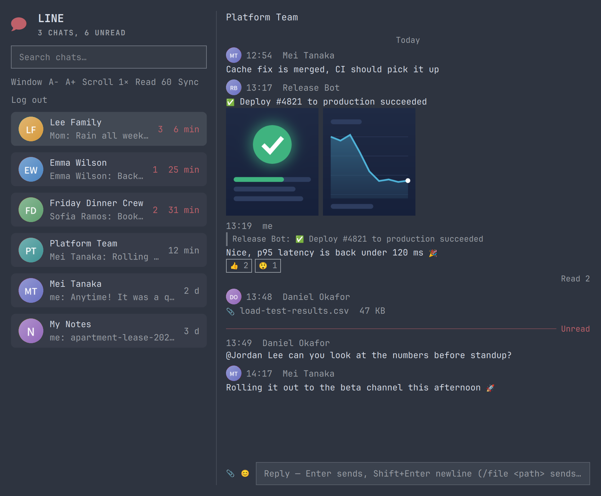
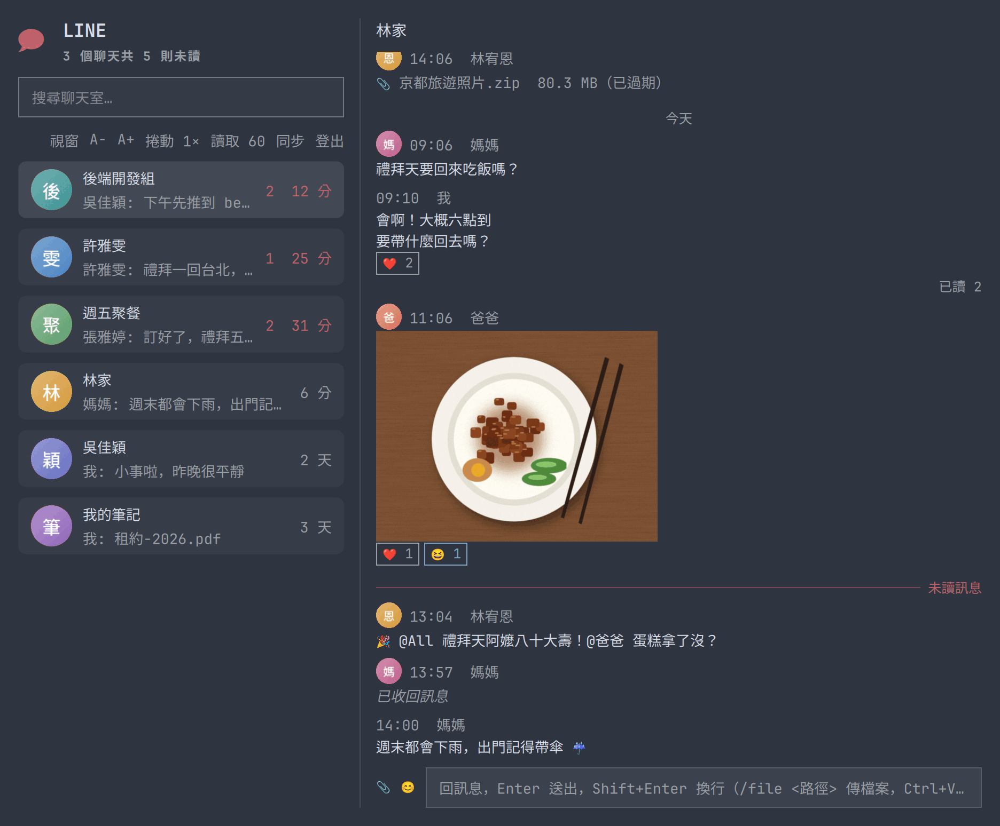

# omarchy-line：Omarchy 上的非官方 LINE 面板

[](https://github.com/frankekn/omarchy-line/actions/workflows/ci.yml)

[English](README.md)

在 Omarchy 的 bar 上看到 LINE 未讀數。點一下就能搜尋聊天室、讀訊息、回覆和傳檔案，
不用離開桌面。

以 [Evex Developers](https://github.com/evex-dev) 的
[linejs](https://github.com/evex-dev/linejs) 為基礎打造。

<!-- verify after merge: docs/images/panel-en.png, docs/images/panel-zh.png and docs/images/bar-icon.png exist -->
|  |  |
| :-: | :-: |
| English | 繁體中文 |


## 免責聲明

本專案與 LY Corporation、LINE Corporation 沒有任何關係，也未受其認可或贊助。
「LINE」是 LY Corporation 的商標。本專案使用這個名稱，只是為了說明外掛搭配的是哪一個
服務。

- **非官方 client，風險自負。** LINE 沒有開放個人帳號的 API。daemon 透過 `linejs`
  登入，那是 LINE 私有協定的非官方 client。使用非官方 client 可能違反 LINE 的使用
  條款，LINE 可以限制或停用這個帳號。本軟體不附任何保證（見 [LICENSE](LICENSE)）。
- **它會佔一個裝置名額。** 你用手機掃 QR 碼登入。daemon 註冊成次要裝置，所以它會
  出現在手機的已登入裝置清單裡。它從不走帳號轉移流程，所以你的手機一直是主要裝置。
- **它把你的 session 和訊息存在磁碟上。** 全部都在 `~/.local/state/enil/`（或
  `$XDG_STATE_HOME/enil/`），權限 `0700`。`storage.json`（權限 `0600`）存登入
  token 與 E2EE 金鑰。`messages/` 保存 daemon 看過的每一則訊息，`media/` 保存下載的
  檔案與縮圖。外掛不加密這些檔案。
- **它在這台電腦上存的資料，你都可以移除。** 在面板登出會結束 session 並刪掉登入
  token。要連其他資料一起移除，請照[解除安裝](#解除安裝)的步驟做。
- **怎麼使用由你負責。** 請遵守 LINE 的使用條款。存在你磁碟上的訊息也包含別人傳的
  訊息，請像傳訊息給你的人所期待的那樣保護它們。

[SAFETY.zh-TW.md](SAFETY.zh-TW.md) 列出每一個檔案、程式碼不做的事，以及它會發出的
網路請求。

## 功能

- bar 圖示上顯示未讀數。登出時圖示顯示 `!`。
- 聊天列表把未讀的排在前面。直接打字就能搜尋聊天室名稱和訊息預覽。
- 對話裡可以看圖片、貼圖、影片縮圖、FLEX 卡片、引用回覆、表情回應，以及自己訊息的
  已讀狀態。開啟 Letter Sealing（端對端加密）的聊天室也能解密。
- 回覆文字、在群組裡用 `@` 提及成員、傳貼圖、檔案、圖片、影片，以及從剪貼簿貼上的
  圖片。可以收回自己的訊息。
- 面板關著時會發桌面通知，點通知會打開面板並進到那個聊天室。
- 只在這台電腦上隱藏聊天室。
- 三種位置：bar 下方、螢幕中央，或一般的應用程式視窗。面板太窄時，工具列會換到第二
  行。
  <!-- verify after merge: toolbar wraps instead of clipping -->
- 繁體中文或英文介面。
- 歷史紀錄存在磁碟上，重開之後打開聊天室不必等 LINE。

鍵盤操作、設定和傳檔案的說明在 [docs/usage.zh-TW.md](docs/usage.zh-TW.md)。

## 需求

- 支援 shell 外掛（有 `omarchy plugin` 指令）的 [Omarchy](https://omarchy.org)。
- [Deno](https://deno.com) 2：`sudo pacman -S deno`。
- 裝了 LINE 的手機，用來掃登入 QR 碼。

下面這些套件是選用的，裝了會多一些功能。少了哪一個，就只少那個功能：

| 套件 | 提供的功能 |
|---|---|
| `zenity` | `📎` 選檔視窗。沒裝也能用 `/file <路徑>`。 |
| `ffmpegthumbnailer` 或 `ffmpeg` | 送出的影片帶預覽圖。 |
| `wl-clipboard` | 複製訊息文字（`wl-copy`），以及傳送剪貼簿裡的圖片（`wl-paste`）。 |
| `libnotify` | 桌面通知（`notify-send`）。 |
| `dbus` | 有 `dbus-monitor` 時，筆電醒來 3 秒後 daemon 就會重新連線。沒有的話，daemon 大約 3 分鐘內會發現連線已經斷了。 |

## 安裝

1. 加入外掛：

   ```bash
   omarchy plugin add https://github.com/frankekn/omarchy-line.git --enable
   ```

2. 安裝 daemon：

   ```bash
   ~/.config/omarchy/plugins/io.github.frankekn.line/daemon/install.sh
   ```

`install.sh` 會做下面這些事，隨時都可以再跑一次：

- 把 linejs submodule 抓到這份 checkout 釘住的 commit。`omarchy plugin add` 只做
  一般的 `git clone`，不會抓 submodule。
- 執行 `deno check`，順便下載 daemon 的相依套件。
- 安裝或更新 systemd user unit `enil.service`。
- 啟用這個 unit 並重新啟動 daemon。

<!-- verify after merge: daemon/install.sh exists and does submodule sync/update, deno check, unit install/refresh, enable/restart -->

看 daemon 的 log：

```bash
journalctl --user -u enil -f
```

## 登入

1. 先把手機拿在手上。登入用的 QR 碼會過期。
2. 點 bar 上的 LINE 圖示，再點「登入 LINE」。
3. 在手機上打開 LINE，點「加入好友」，再點「行動條碼」，掃描面板上的 QR 碼。
4. 面板會顯示一組 PIN，在手機上輸入。

登入成功後，bar 圖示上的 `!` 會消失。QR 碼過期的話，點「再試一次」。

要登出，點面板工具列上的「登出」。

## 更新

```bash
omarchy plugin update io.github.frankekn.line
~/.config/omarchy/plugins/io.github.frankekn.line/daemon/install.sh
omarchy restart shell
```

`omarchy plugin update` 只更新主 repo。`install.sh` 會更新 linejs submodule 並重新
啟動 daemon，讓面板和 daemon 維持在同一個版本。

## 解除安裝

1. 在面板登出。這會在 LINE 那邊結束 session。
2. 停掉 daemon，移除外掛和它的資料：

   ```bash
   systemctl --user disable --now enil
   rm -f ~/.config/systemd/user/enil.service
   systemctl --user daemon-reload
   rm -rf ~/.local/state/enil
   omarchy plugin remove io.github.frankekn.line
   ```

3. 在手機 LINE 的已登入裝置清單裡，如果還看得到這台裝置，就把它移除。

`~/.local/state/enil` 存著你的 session、金鑰、訊息歷史和媒體。刪掉它，這些資料就
從這台電腦上移除了。

## 常見問題

**LINE 會因為這個停用我的帳號嗎？** 有可能。LINE 沒有提供這種存取方式，允不允許由
LINE 決定。daemon 以次要裝置登入，除非你在面板上操作，它不會送出任何訊息、表情回應
或已讀。LINE 回報帳號受到限制時，daemon 會停掉所有自動發出的 LINE 流量並告訴你。
<!-- verify after merge: restriction stop and panel message -->

**會把我的手機登出嗎？** 不會。daemon 以次要裝置用 QR 碼登入，從不使用帳號轉移，而
帳號轉移才是會更換主要裝置的流程。

**可以在好幾台電腦上用嗎？** 每台電腦各自掃 QR 碼登入，每一台都會是獨立的裝置。不要
把 state 目錄從一台電腦複製到另一台：LINE 每次登入都會換 refresh token，所以一個
session 只能有一個 daemon 使用。

**支援 Letter Sealing（端對端加密）嗎？** 支援。daemon 持有這台裝置的 Letter Sealing
金鑰，會解密開啟 Letter Sealing 的聊天室裡的訊息。你傳訊息時，如果對方要求加密，
linejs 會加密後再送。這些聊天室裡的影片會顯示成沒有縮圖的附件，因為縮圖也是加密的。

**我的資料在哪裡？** 在 `~/.local/state/enil/`。[SAFETY.zh-TW.md](SAFETY.zh-TW.md)
列出每一個檔案和它存的內容。

**為什麼不用 Matrix bridge？** [Matrix 的 LINE bridge](https://matrix.org/ecosystem/bridges/line/)
需要一台 Matrix homeserver 和一個 Matrix client，你的訊息會經過 bridge。omarchy-line
是你電腦上的一個 daemon，加上 Omarchy bar 上的一個面板。如果你本來就在用 Matrix，
bridge 能把 LINE 跟你其他的聊天放在一起。

## 其他選擇

- LINE 官方的 Windows 與 macOS 桌面版。
- LINE 官方的 [Chrome 擴充功能](https://chromewebstore.google.com/detail/line/ophjlpahpchlmihnnnihgmmeilfjmjjc)。
- [Matrix bridge](https://matrix.org/ecosystem/bridges/line/)。

## daemon 為什麼叫 enil

`enil` 就是把「LINE」倒過來拼。

## 文件

- [docs/usage.zh-TW.md](docs/usage.zh-TW.md)：鍵盤操作、設定、檔案與通知。
- [docs/architecture.zh-TW.md](docs/architecture.zh-TW.md)：面板和 daemon 怎麼合作。
- [docs/protocol.zh-TW.md](docs/protocol.zh-TW.md)：state 檔案與 socket 指令。
- [docs/vendoring.zh-TW.md](docs/vendoring.zh-TW.md)：內附的 linejs fork。
- [docs/development.zh-TW.md](docs/development.zh-TW.md)：檢查、stub daemon 與 CI。
- [CONTRIBUTING.zh-TW.md](CONTRIBUTING.zh-TW.md)：pull request 的規則。
- [CHANGELOG.md](CHANGELOG.md)：每個版本改了什麼（英文）。

## 安全與漏洞回報

- [SAFETY.zh-TW.md](SAFETY.zh-TW.md) 說明外掛怎麼處理你的帳號和你磁碟上的資料。
- [SECURITY.zh-TW.md](SECURITY.zh-TW.md) 說明怎麼私下回報漏洞。

## 致謝

- [Evex Developers](https://github.com/evex-dev) 的
  [linejs](https://github.com/evex-dev/linejs)，主要維護者是
  [EdamAme-x](https://github.com/EdamAme-x)，還有
  [許多貢獻者](https://github.com/evex-dev/linejs/graphs/contributors)。沒有它，
  omarchy-line 沒辦法跟 LINE 溝通。內附的副本保留它的 MIT 授權檔
  [`daemon/vendor/linejs/LICENSE`](daemon/vendor/linejs/LICENSE)。本專案有幾個修正
  已經回饋到上游，例如 [#239](https://github.com/evex-dev/linejs/pull/239) 和
  [#240](https://github.com/evex-dev/linejs/pull/240)，完整清單見
  [docs/vendoring.zh-TW.md](docs/vendoring.zh-TW.md#回饋給上游的修正)。
- [Unayung Chen](https://github.com/Unayung) 寫了最初的 omarchy-line 外掛。本專案
  一開始是它的 fork，版本號也接續那個專案的 2.x。
- [Omarchy](https://omarchy.org) 和它的 shell 外掛系統。
- [Quickshell](https://quickshell.org)，Omarchy shell 和這個面板都跑在它上面。

## 授權

[MIT](LICENSE)。
